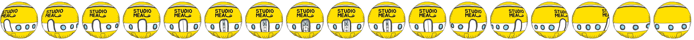

# 인터렉티브 웹 개발 공부

## 계획

CSS 공부 이기 때문에 하루종일 공부하는 것 보다는 현재 계획중인 그리고 진행중인 프로젝트에 지장가지 않는 선에서 공부 할 예정입니다. 많은 시간을 쏟기 보다는 딱 집중도 있게 1시간 30분 ~ 2시간 진행

## 진행하기 전에

CSS3를 지원하는 브라우저에서만 가능한 CSS 입니다. 인터렉티브웹은 옛날 브라우저에서는 JQuery를 이용해야 하기 때문에 그냥 최신 브라우저에서만 작동한다는 전제에서 진행 합니다.

# ✅ chapter_1 > 01.html

## Transform CSS

1. scale : 크기 변형
2. rotate : 회전
3. skew : 비틀기
4. translate : 이동

### transform-origin

> 변형되는 것에 대한 기준점을 변경시켜주는 키워드 입니다.

ex) transform-origin : center center || 50% 50%(기본값)

만약 기준점을 왼쪽 상단으로 변경하고 싶다면

`transform-origin:left top` || `transform-origin: 0% 0%`

## transition

transform에 의한 변형에 대해서 몇가지 기능을 추가해준다고 생각하면 될 것같다. 변형됨에 있어서 조금더 자연스럽게 바꿔준다.

### transition 축약형

transition은 총 4개의 속성을 가집니다.

`transition: property,duration,timing-function,delay`

기본값 : `all 0 ease 0`

이 속성을 개별적으로 줄 수도 있지만 축약형을 사용하는게 코드가 보기 좋다.

> - duration : 변형이 진행되는 시간을 의미합니다.
>   1s라고 입력해주게 된다면 1초동안 변형이 진행됨을 의미합니다.
> - timing-function : 변형에 대한 에니메이션적인 부분을 다루는 속성입니다. 기본값은 ease이며 여러개의 function이 존재하며 원한다면 직접 만들 수도있습니다.(cubic-bezier)
> - delay : 변형이 시작하기 전에 딜레이를 주는 것
>   1s이면 1초뒤에 변형이 시작됨을 의미함
> - property : 변형되는 css 속성을 의미합니다.

### transition 사용시 주의할점 🚫

transition은 반드시 변형되는 css 속성이 숫자인 경우에만 사용 가능합니다. 아래 코드를 봅시다.

```css
.box {
  width: auto;
  height: 100px;
  background: rgba(255, 255, 0.7);
  transition: 2s;
}

.box:hover {
  width: 200px;
  background: red;
}
```

이렇게 작성하면 width값은 duration이 적용되지 않고 color만 duration이 적용되는 것을 볼 수있습니다.
이는 box의 css 속성 중 width의 값이 하나의 특정한 값을 가지는 것이 아니라 auto라는 자동적으로 내부의 컨텐츠에 따라 width를 지정해주기 때문에 transition이 작동하지 않는 걸 볼 수 있습니다.

# ✅ chapter_1 > 02.html

## Animation

### keyframes

keyframes를 이용해 하나의 animation을 생성할 수 있습니다.
이를 사용할 때 타임라인을 설정해줘야 하는데 이는 에니메이션의 진행율에 따라서 각각의 변형을 할 수있습니다. (0%,50%,100% ...)

```css
@keyframes ex-ani {
  0% {
    transform: translate(0, 0);
  }
  50% {
    transform: translate(500px, 0);
  }
  100% {
    transform: translate(500px, 500px);
  }
}
```

위와 같은 에니메이션을 적용 한다면

1. animation-name : ex-ani
2. animation-duration :2s
3. animation-timing-function : ease
4. animation-delay : 0s
5. animation-iteration-count : 1
6. animation-direction : normal
7. animation-fill-mode : none
8. animation-play-state : running

위의 속성들을 한번에 축약하면 `animation:ex-ani 2s`로 사용가능 합니다.

animation-iteration-count는 해당 에니메이션이 실행되는 횟수를 의미합니다. 3으로 설정하면 3번 반복되고 infinite로 설정하면 무한 반복됩니다.

### animation-direction

normal 이면 0% -> 50% -> 100% ->0% ->50% ->100% 이렇게 반복

alternate 이면 0% -> 50% ->100%-> 50% -> 0% 이렇게 반복됩니다.

reserve 이면 역으로 진행

### animation-fill-mode

기본값은 none이며 이 경우에는 에니메이션이 끝나면 다시 0%의 속성으로 돌아간다.
이 값을 forwards로 변경해주면 0% ~ 100% 진행되고 끝났을 때 100%의 속성에 위치한다.

# ✅ chapter_1 > 03.html

스프라이트 이미지를 이용해보기



다음과 같은 스프라이트 이미지를 이용해 움직이는 이미지 만들어 보자.

먼저 위의 sprite 이미지는 width 5100px height 300px 입니다.

그러면 하나의 17개의 행성 이미지가 있고 하나당 width 300px height 300px의 크기를 가집니다.

그러나 요즘은 이미지를 미리 사용할 이미지크기 보다 2배의 크기로 만든다고 합니다. 고해상도 디스플레이에서 선명하게 이미지를 표현하기 위함이라고 합니다. 따라서 현재 300px 300px도 미리 2배로 만든 이미지 이기 때문에 실제로 사용할 때는 150px 150px의 box를 생성해줘야 합니다.

```css
@keyframes spaceship-ani {
  100% {
    background-position: -2550px 0;
  }
}

.spaceship {
  width: 150px;
  height: 150px;
  background: url(...) no-repeat 0 0 / cover;
  animation: spaceship-ani 1s infinite steps(17);
}
```

원래의 position은 0 0이었고 초기 값은 생략 가능합니다.
0 0의 포지션에서 마지막은 제일 끝 점인 -2550px 0으로 이동시켜줍니다.
steps(17)을 해준 이유는 스프라이트 이미지에서 각각의 이미지가 총 17개 존재하기 때문에 에니메이션을 17단계에 나눠서 진행하겠다고 설정해준 것입니다.
